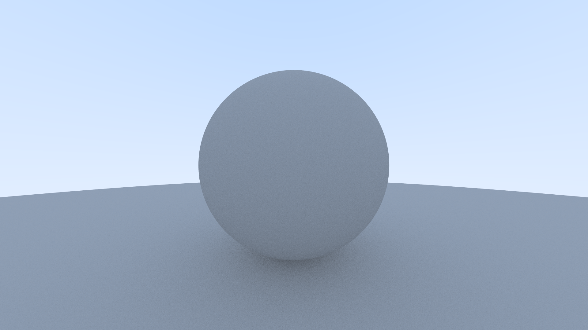

# quartz

A single threaded ray tracing engine.



## Building:

```
git clone git@github.com:arindas/quartz.git
cd quartz/
mkdir build
cd build
cmake ..
make
```

This produces a binary `quartz` at `quartz/build/quartz`.

## Usage:

Right now, quartz writes `.ppm` images to the standard output. Hence, users
are request to redirect it's output to a file:

```
./quartz > output_image.ppm
```

Most image viewers can view `.ppm` files natively. However, for conveniently
sharing the images, ppm images can be converter to other formats using
ImageMagick's convert tool on Linux. For instance, to convert to png:

```
convert output_image.ppm output_image.png
```

Later, `quartz` will have native support for multiple formats.

## Configuration:

`quartz` at it's core is a header only library. All scene configuration is specified
in quartz/main.cc, it being the only c++ source file in this repository.

Image size is configured as:
```cpp
...
quartz::image_size size = quartz::get_image_size(16.0 / 9.0, // aspect ratio
                                                 225);       // image height
...
```

Objects can be added to the scene as follows:
```cpp
...
quartz::scene world;
world.add(std::make_shared<quartz::sphere>(
    quartz::point3(0, 0, -1), 0.5));
world.add(std::make_shared<quartz::sphere>(
    quartz::point3(0, -100.5, -1), 100));
...
```
Right now, only spheres are supported. Support for multiple 3D objects will be added later.

`quartz` supports antialiasing. The number of samples per pixel is specified at the time
of invoking `quartz::renderer::render()`:

```cpp
...
quartz::renderer renderer_(size, world);

int samples_per_pixel = 100;
renderer_.render(tracer, cam, samples_per_pixel);
...
```

`quartz` renders images to an in-memory buffer (`quartz::image_sink`) first. The contents
of this buffer are later serialized by different implementations of `quartz::image_writer`.
The only `quartz::image_writer` implementation right now is `quartz::ppm_image_writer`.

## TODO

- [ ] Add support for different materials
- [ ] Parallelize the render loop
- [ ] Add support for different image formats.
- [ ] Add support for multiple 3D hittables.
